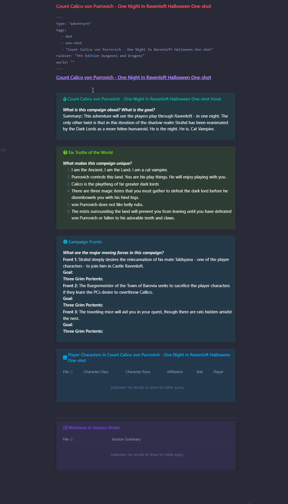

# ViX's Adventure Template

**Plugin Dependencies**:

**[Admonitions](https://github.com/valentine195/obsidian-admonition)**

**[Dataview](https://github.com/blacksmithgu/obsidian-dataview)**

**[Templater](https://github.com/SilentVoid13/Templater)**

**Thanks To**: Vix

## Goals

Provide aesthetically interesting, consistent structure and templates to assist preparing for a D&D session, campaign or adventure.

## How It May Look



## How to Use

Remove the back-tick code blocks that are marked out with the phrases "Remove this line and the all the ones above it." and "Remove this line and all the ones below it.".

Once those are gone, the template is ready to be used in Obsidian.

`````
Remove this line and the all the ones above it.

---
type: "adventure"
tags:
  - dnd
  - campaign
  - "Vital Singularity"
ruleset: "5th Edition Dungeons and Dragons"
world: ""
---
# [[Vital Singularity]]


```ad-important
title: Vital Singularity Hook
***What is this campaign about? What is the goal?***
Summary:: 
```

```ad-faq
title: Six Truths of the World
***What makes this campaign unique?***
1.
2.
3.
4.
5.
6.
```

```ad-info
title: Campaign Fronts:
***What are the major moving forces in this campaign?***
---
**Front 1:**
**Goal:**
**Three Grim Portents:**
---
**Front 2:**
**Goal:**
**Three Grim Portents:**
---
**Front 3:**
**Goal:**
**Three Grim Portents:**
```

````ad-tldr
title: Player Characters in Vital Singularity
```dataview
TABLE
class AS "Character Class",
race AS "Character Race",
organization AS "Affiliation",
ddb_link AS "link:",
player AS "Player"
FROM #player-characters AND [[Vital Singularity]]
```
````


---
````ad-example
title: Mentions in Session Notes
```dataview
TABLE summary AS "Session Summary" FROM #session-notes AND [[Vital Singularity]]
```
````

Remove this line and all the ones below it.
`````
