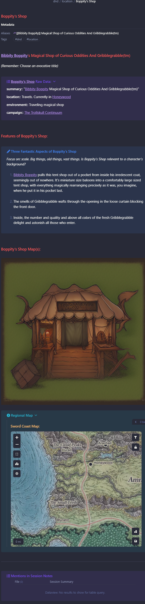

# Vix's Location Template

**Plugin Dependencies**:

**[Admonitions](https://github.com/valentine195/obsidian-admonition)**

**[Dataview](https://github.com/blacksmithgu/obsidian-dataview)**

**[Leaflet](https://github.com/valentine195/obsidian-leaflet-plugin)**

**[Templater](https://github.com/SilentVoid13/Templater)**

**Thanks To**: Vix

## Goals

Provide aesthetically interesting, consistent structure and templates to assist preparing for a D&D session, campaign or adventure.

## How It May Look



## How to Use

Remove the back-tick code blocks that are marked out with the phrases "Remove this line and the all the ones above it" and "Remove this line and all the ones below it".

Once those are gone, the template is ready to be used in Obsidian.

``````
Remove this line and all the ones above it.

---
aliases:
type: "location"
tags:
  - "dnd"
  - "location"
---
# Vital Singularity
*(Remember: Choose an evocative title)*
```ad-example
title: [[Vital Singularity]]  Raw Data:
collapse: closed
**summary**:: ""
**location**:: 
**environment**:: 
**campaign::** 
```

# Features of Vital Singularity:
```ad-note
title: Three Fantastic Aspects of Vital Singularity
*Focus on: scale. Big things, old things, vast things. Is Vital Singularity relevant to a character's background?*
1. -
2. -
3. -
```

# Vital Singularity Map(s):
````ad-info
title: Map
collapse: open
```leaflet
id: "Vital Singularity" 
image:   
defaultZoom: 6 
zoomDelta: .5 
scale: 145
```
````

```ad-info
title: Regional Map
collapse: open
![[Faerun#Faerun Map|...]]
```


---
````ad-example
title: Mentions in Session Notes
```dataview
TABLE summary AS "Session Summary" FROM #session-notes AND [[Vital Singularity]]
```
````


Remove this line and the one below it.
``````
