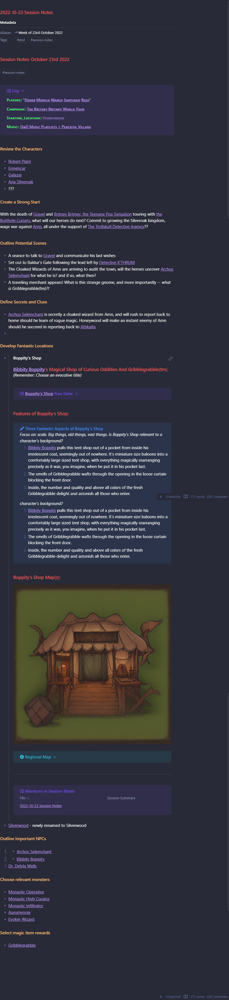

# Vix's Session Template

**Plugin Dependencies**:

**[Admonitions](https://github.com/valentine195/obsidian-admonition)**

**[Templater](https://github.com/SilentVoid13/Templater)**

**Thanks To**: Vix

## Goals

Provide aesthetically interesting, consistent structure and templates to assist preparing for a D&D session, campaign or adventure.

## How It May Look



## How to Use

Remove the back-tick code blocks that are marked out with the phrases "Remove this line and the all the ones above it" and "Remove this line and all the ones below it".

Once those are gone, the template is ready to be used in Obsidian.

````yaml
Remove this line and all the ones above it.

---
alias: "Week of 29th January 2023"
type: "session-notes"
tags:
  - "dnd" 
  - "session-notes"
date_created: 2023-01-23
dnd_session_date: 
summary: [""]
---
# Session Notes: January 29th 2023
#session-notes 
```ad-example
title: Log
collapse: open
#### Players:: ""
#### **Campaign**:: 
#### Starting_Location::
#### Music::
```


## Review the Characters


## Create a Strong Start


## Outline Potential Scenes


## Define Secrets and Clues


## Develop Fantastic Locations


## Outline Important NPCs
1. - 
2. -
3. -

## Choose relevant monsters


## Select magic item rewards


Remove this line and all the ones below it.
````
