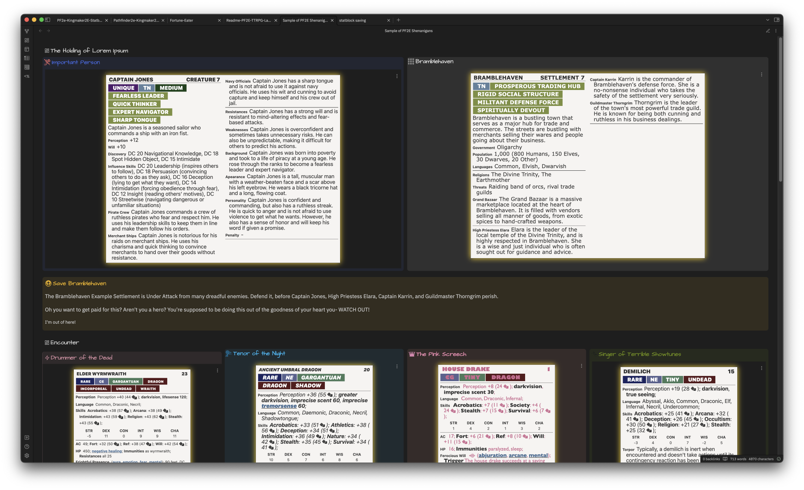

# Readme for PF2E Bestiary Statblocks

The Obsidian TTRPG Share team presents the Release Candidate 1 for the Pathfinder 2E TTRPG Statblock Layout.

## Features



> **Note**: The custom callouts are altering the statblock font and look. The main thing to note is the differing types of traits and layout now available up top and how they coexist.

1. Fully fleshed and *mostly*\* theme-proof statblock layout.
2. Initiative tracker integration
3. Most fields accept markdown (But do not use asterisks, use underscores!)
4. Conditional fields
5. Commented CSS File so you can make it your own.

\* ITS Theme users, there may still be *some* formatting issues until the new release. Alternatively, you can switch to using ITS Beta.

### A Special Thanks

> The Developers who took on this task are Sigrunixia/LittleMaelstrom, and Fate. The repository will be its maintainers but Sigrunixia and Fate will continue to take a lead role in updates as they work to transition to making this statblock layout into an official layout included within TTRPG Statblocks.
> Additionally, thanks goes to [Moritz Jung](https://github.com/mProjectsCode) who created the Pathfinder 2E Kingmaker layouts, and who gave me quite a fun challenge in merging the css files together. :) \- Sigrunixia

## What You Need to Make This Statblock Shine

1. [Path2eBlock.json](_attachments/Path2eBlock.json), to install into TTRPG Statblocks
2. [Pathfinder2E-TTRPG-Statblock](_attachments/Pathfinder2E-TTRPG-Statblock.css) into your `.obsidian/snippets` folder.

If you want the extra Kingmaker layouts, check out the [Pathfinder2e-Kingmaker2e-Readme](../Kingmaker_Layouts/Pathfinder2e-Kingmaker2e-Readme.md). They can be used alongside the bestiary layouts.

### Optional

1. This [Template-2ETools-Monster-Handlebar](Template-2ETools-Monster-Handlebar.md) file to take .json data from the [PF2E Tools Bestiary](https://pf2etools.com/bestiary.html#aapoph%20serpentfolk_b2) to your vault. Complete with YAML data for Initiative Tracker.

You will need to use [Obsidian Import Json](https://github.com/farling42/obsidian-import-json) to use this handlebar template.

## Required Plugins

1. [Obsidian TTRPG Statblocks](https://github.com/valentine195/obsidian-5e-statblocks)
2. [Obsidian Dice Rollers](https://github.com/valentine195/obsidian-dice-roller)

### Optional But Nice

1. [Obsidian Initiative Tracker](https://github.com/valentine195/obsidian-initiative-tracker)

## Example Clockwork Dragon

```statblock
layout: Path2eBlock
statblock: true
source: "B3"
name: "Clockwork Dragon"
level: "Creature 16"
rare_03: "Rare"
alignment: "N"
size: "Huge"
trait_04: "Clockwork"
trait_05: "Construct"
trait_06: "Mindless"
modifier: 28
perception:
  - name: "Perception"
    desc: "Perception +28; __darkvision__;"
skills:
  - name: "Skills"
    desc: "__Acrobatics__: +29 (1d20+29); __Athletics__: +33 (1d20+33); "
abilityMods: [9, 5, 5, -5, 4, -5]

abilities_mid:
  - name: "Self-Destruct"
    desc: "⬲ __Trigger__ The clockwork dragon is reduced to 0 Hit Points __Effect__  A clockwork dragon must use this reaction unless specifically programmed otherwise by its creator; ; The dragon screeches to a stop and emits a steady, loud ticking sound. At the beginning of what would have been its next turn, the dragon explodes, dealing 12d10 (12d10) piercing damage in a 40-foot emanation (DC 37 basic Reflex save). An adjacent creature can cancel the self-destruct sequence by succeeding at a DC 37 [[Thievery]] check to [[Disable a Device]]."
abilities_bot:
  - name: "Breath Weapon"
    desc: "⬺ ([[arcane]], [[evocation]], [[fire]]);  The clockwork dragon breathes a spray of flaming oil that deals 16d6 (16d6) fire damage in a 40-foot cone (DC 37 basic Reflex save). Creatures that fail their saves are covered in burning oil and take 2d6 (2d6) [[persistent damage|persistent fire damage]]. The clockwork dragon can't use Breath Weapon again for 2 rounds."
  - name: "Draconic Frenzy"
    desc: "⬺  The clockwork dragon makes two claw [[Strike|Strikes]] and one wing [[Strike]] in any order."
  - name: "Spearing Tail"
    desc: "⬺  The clockwork dragon attacks with the sharp point of its tail. It makes a tail [[Strike]] against each creature in a 20-foot line, rolling the attack roll once and applying the result to each target. Any creature hit takes 4d6 (4d6) [[persistent damage|persistent bleed damage]] (doubled on a critical hit) This counts as two attacks for the dragon's multiple attack penalty."

speed: 40 feet, fly 120 feet

ac: 39
armorclass:
  - name: AC
    desc: "39; __Fort__: +30 (1d20+30); __Ref__: +28 (1d20+28); __Will__: +25 (1d20+25);"
hp: 265
health:
  - name: HP
    desc: "265;  __Immunities__ mental, poison, death effects, disease, doomed, drained, fatigued, healing, necromancy, nonlethal attacks, paralyzed, sickened, unconscious; __Weaknesses__ electricity 15, orichalcum 15; __Resistances__ physical 15."

attacks:
  - name: Melee
    desc: "⬻ adamantine jaws +33 ([[reach|reach 15 feet]]); __Damage__ 3d12+17 (3d12+17) piercing."
  - name: Melee
    desc: "⬻ adamantine claw +33 ([[agile]], [[reach|reach 10 feet]]); __Damage__ 3d8+17 (3d8+17) slashing."
  - name: Melee
    desc: "⬻ tail +31 ([[reach|reach 20 feet]]); __Damage__ 3d12+15 (3d12+15) bludgeoning."
  - name: Melee
    desc: "⬻ wing +31 ([[agile]], [[reach|reach 15 feet]]); __Damage__ 2d10+15 (2d10+15) piercing."

sourcebook: "_Bestiary 3_, page 51."
```
### Encounter

```encounter-table
name: Clockwork Dragon
creatures:
  - 1: Clockwork Dragon
```