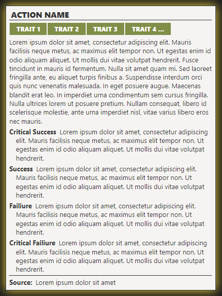
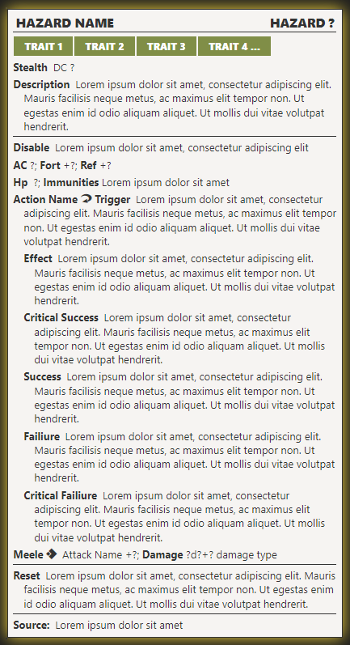
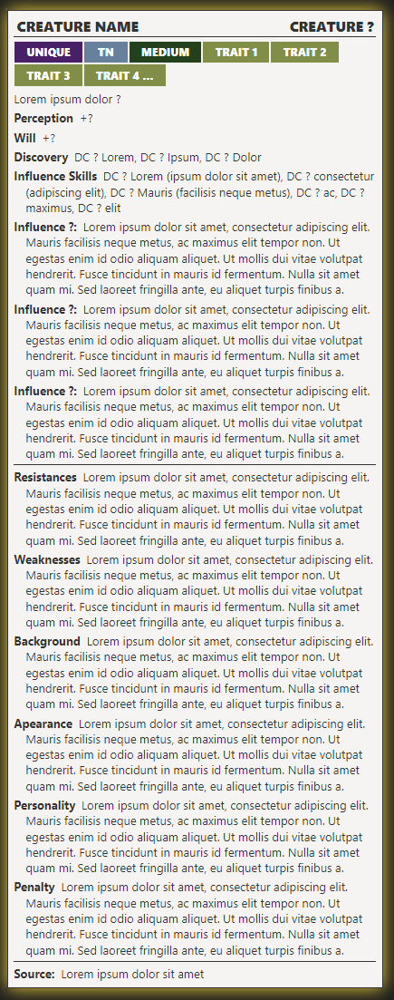
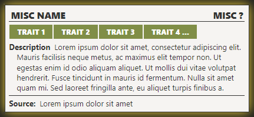
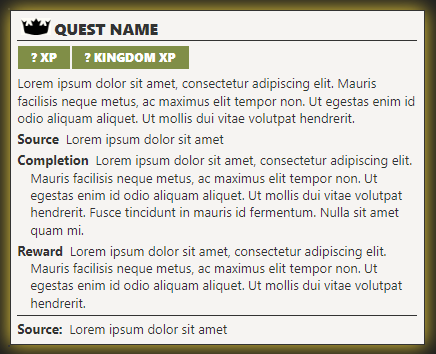
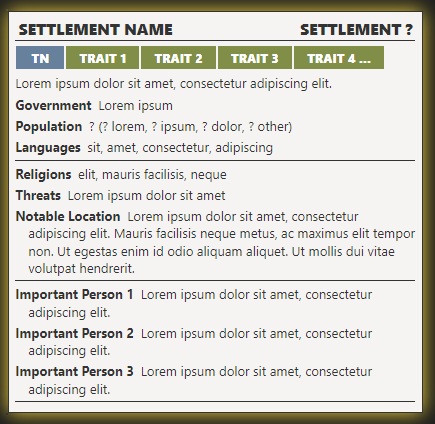

# Kingmaker and Miscellaneous PF2e Statblocks

This folder includes some miscellaneous statblocks for Pathfinder 2e. All of these statblocks are modeled after the statblocks in the Kingmaker 2e Adventure Path.

## Statblock Howto

**What you will Need**:

1. The [Pathfinder2E-TTRPG-Statblock](../Bestiary_Layouts/_attachments/Pathfinder2E-TTRPG-Statblock.css) installed into your `obsidian/snippets` and toggled enabled within appearances.
2. Your .json of choice. Each one is linked by the image below.
3. Once you choose your json, import it into TTRPG Statblocks, then use the [PF2e-Kingmaker2E-Statblock-Checker](PF2e-Kingmaker2E-Statblock-Checker.md) to see that the statblock loads correctly.

### Action

**Json Link**: [Path2eBlockAct](_attachments/Path2eBlockAct.json)

### Hazard

**Json Link**: [Path2eBlockHaz](_attachments/Path2eBlockHaz.json)

### Influence

**Json Link**: [Path2eBlockInf](_attachments/Path2eBlockInf.json)

### Misc

**Json Link**: [Path2eBlockMisc](_attachments/Path2eBlockMisc.json)

### Quest

**Json Link**: [Path2eBlockQuest](_attachments/Path2eBlockQuest.json)

**Quest Icon Link**: [pf2e-quest-icon](_attachments/pf2e-quest-icon.png)

### Settlement

**Json Link**: [Path2eBlockSet](_attachments/Path2eBlockSet.json)

