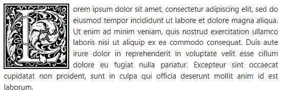

# foreveryone's Dropcaps Snippet

**Dependencies**:

[**foreveryones_dropcaps.css**](css/foreveryones_dropcaps.css) from the css folder


[**William Morris Letter Clipart @ Open Clipart**](https://openclipart.org/search/?query=William+Morris) from the images folder

*All content under Open Clipart is licensed under* [***Creative Commons 1.0 License***](https://creativecommons.org/publicdomain/zero/1.0/).

**Thanks to**: [**Foreveryone1**](https://github.com/foreveryone1)


## What It May Look Like




## How To Install

### Snippet

Place the dropcap snippet into your **`.obsidian/snippets/`** folder.

Activate the snippet inside Obsidian's settings -> Appearance. 

## How to Use

Once you have enabled this snippet in appearance, insert  **`<span class="dropcap REPLACELETTER"></span>`** followed by a linebreak to open a paragraph with a dropcap.

**`REPLACELETTER`** is any of the included 26 latin letters, in lowercase: a, b, c, d, e, etc.

Example: **`<span class="dropcap a"></span>`**

If you want to adjust the size of the dropcap, change the width and height parameters in the dropcaps.css.

```css
.dropcap {
width: 150px;
height: 150px;
}
```


### Caveats

This snippet has been tested on Default, Minimal, ITS Theme, Ebullientworks, AnuPpuccin, Wyrd, and Shimmering Focus. It worked on every theme and you will find some slight variances on the spacing distance from the icon to the text as expected. However, it suffered from the same issue on dark backgrounds- the letter disappears. 


A callout background is underway for this dropcap CSS, and is undergoing additional testing. This page will be updated when it is released. 
