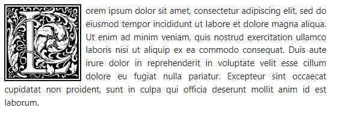
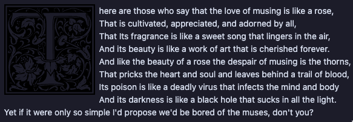

# foreveryone's Dropcaps Snippet

__Dependencies__:

[__foreveryones_dropcaps.css__](_attachments/foreveryones_dropcaps.css) from this folder.

[__William Morris Letter Clipart @ Open Clipart__](https://openclipart.org/search/?query=William+Morris) from this folder.

*All content under Open Clipart is licensed under* [*__Creative Commons 1.0 License__*](https://creativecommons.org/publicdomain/zero/1.0/).

__Thanks to__: [__Foreveryone1__](https://github.com/foreveryone1)

## What It May Look Like



## How To Install

Place the dropcap snippet into your __`.obsidian/snippets/`__ folder.

Activate the snippet inside Obsidian's settings -> Appearance.

## How to Use

Once you have enabled this snippet in appearance, insert __`<span class="dropcap REPLACELETTER"></span>`__ followed by a linebreak to open a paragraph with a dropcap.

__`REPLACELETTER`__ is any of the included 26 latin letters, in lowercase: a, b, c, d, e, etc.

Example: __`<span class="dropcap a"></span>`__

If you want to adjust the size of the dropcap, change the width and height parameters in the dropcaps.css.

```css
.dropcap {
width: 150px;
height: 150px;
}
```

### Current Caveats

This snippet has been tested on Default, Minimal, ITS Theme, Ebullientworks, AnuPpuccin, Wyrd, and Shimmering Focus. It worked on every theme and you will find some slight variances on the spacing distance from the icon to the text as expected. However, it suffered from the same issue on dark backgrounds; the letter disappears.Here it is on AnuPpuccin, for example.



> __Note__: A callout background is underway for this dropcap CSS to be used for light and dark backgrounds, and is undergoing additional testing. This page will be updated when it is released.
