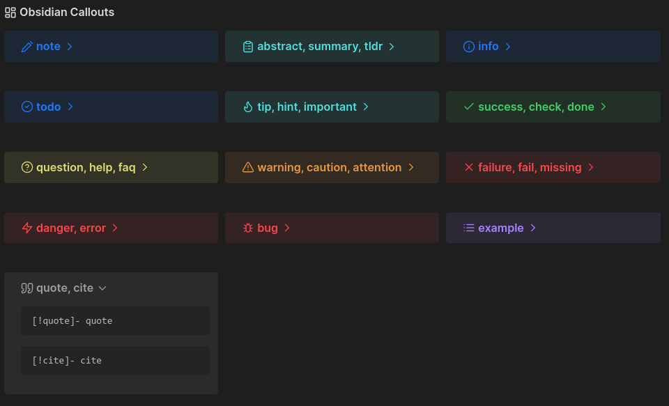

# Obsidian Callouts

%% 
You will need to have the **[ITS Callouts](https://github.com/SlRvb/Obsidian--ITS-Theme/blob/main/Guide/Callouts.md)** snippet to use the columns callout in this note. If successful. Your note will look like similar to this.


%%


**Source**: https://help.obsidian.md/How+to/Use+callouts

> [!columns|3] Obsidian Callouts
> > [!note]- note
> > ```
> > > [!note]- note
> > ```
> 
> > [!abstract]- abstract, summary, tldr
> > ```
> > > [!abstract]- abstract
> > ```
> > ```
> > > [!summary]- summary
> > ```
> > ```
> > > [!tldr]- tldr
> > ```
> 
> > [!info]- info
> > ```
> > > [!info]- info
> > ```
> 
> > [!todo]- todo
> > ```
> > > [!todo]- todo 
> > ```
> 
> > [!tip]- tip, hint, important
> > ```
> > > [!tip]- tip
> > ```
> > ```
> > > [!hint]- hint
> > ```
> > ```
> > > [!important]- important
> > ```
> 
> > [!success]- success, check, done
> > ```
> > [!success]- success
> > ```
> > ```
> > [!check]- check
> > ```
> > ```
> > [!done]- done
> > ```
> 
> > [!question]- question, help, faq
> >  ```
> > [!question]- question
> > ```
> >  ```
> > [!help]- help
> > ```
> >  ```
> > [!faq]- faq
> > ```
> 
> > [!warning]- warning, caution, attention
> >  ```
> > [!warning]- warning
> > ```
> >  ```
> > [!caution]- caution
> > ```
> >  ```
> > [!attention]- attention
> > ```
> 
> > [!failure]- failure, fail, missing 
> >  ```
> > [!failure]- failure
> > ```
> >  ```
> > [!fail]- fail
> > ```
> >  ```
> > [!missing]- missing
> > ```
> 
> > [!danger]- danger, error
> >  ```
> > [!danger]- danger
> > ```
> >  ```
> > [!error]- error
> > ```
> 
> > [!bug]- bug
> >  ```
> > [!bug]- bug
> > ```
> 
> > [!example]- example
> >  ```
> > [!example]- example
> > ```
> 
> > [!quote]- quote, cite
> >  ```
> > [!quote]- quote
> > ```
> >  ```
> > [!cite]- cite
> > ```
