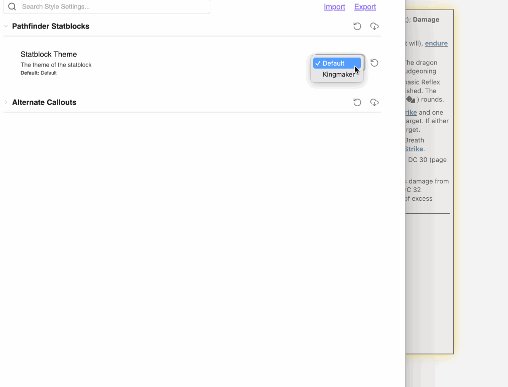
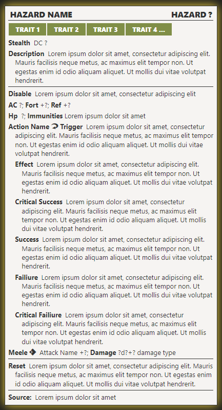
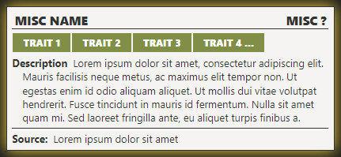
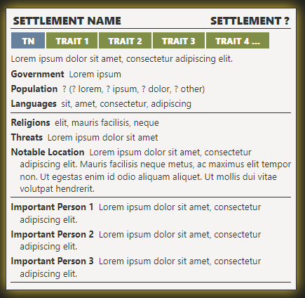

# Kingmaker and Kingmaker-Themed Pathfinder 2nd Edition Statblocks

This folder includes some miscellaneous statblocks for Pathfinder 2e. All of these statblocks are modeled after the statblocks in the Kingmaker 2e Adventure Path. If you have not already, please read the [README-PF2E-Default-Layout](../Default_Layouts/README-PF2E-Default-Layout.md) page first.  

## Statblock Layout Installation Guide

You will need the following items:
1. The [Pathfinder2E-TTRPG-Statblock-v1.3](../Default_Layouts/_attachments/Pathfinder2E-TTRPG-Statblock-v1.3.css) installed into your `obsidian/snippets` and toggled enabled within appearances.
2. Your .json file of choice. Each one is linked by the appropriate image below.

Once you have those items, you will need to:
1. Import the .json file into TTRPG Statblocks.
2. Use the [PF2E-Kingmaker2E-Statblock-Checker](PF2E-Kingmaker-Layouts-Checker.md) to test that the statblock loads correctly.

### Action

**Json Link**: [Path2eBlockAct](_attachments/Path2eBlockAct.json)

### Hazard

**Json Link**: [Path2eBlockHaz](_attachments/Path2eBlockHaz.json)

### Influence

**Json Link**: [Path2eBlockInf](_attachments/Path2eBlockInf.json)

### Misc

**Json Link**: [Path2eBlockMisc](_attachments/Path2eBlockMisc.json)

### Quest

**Json Link**: [Path2eBlockQuest](_attachments/Path2eBlockQuest.json)

**Quest Icon Link**: [pf2e-quest-icon](_attachments/pf2e-quest-icon.png)

### Settlement

**Json Link**: [Path2eBlockSet](_attachments/Path2eBlockSet.json)

