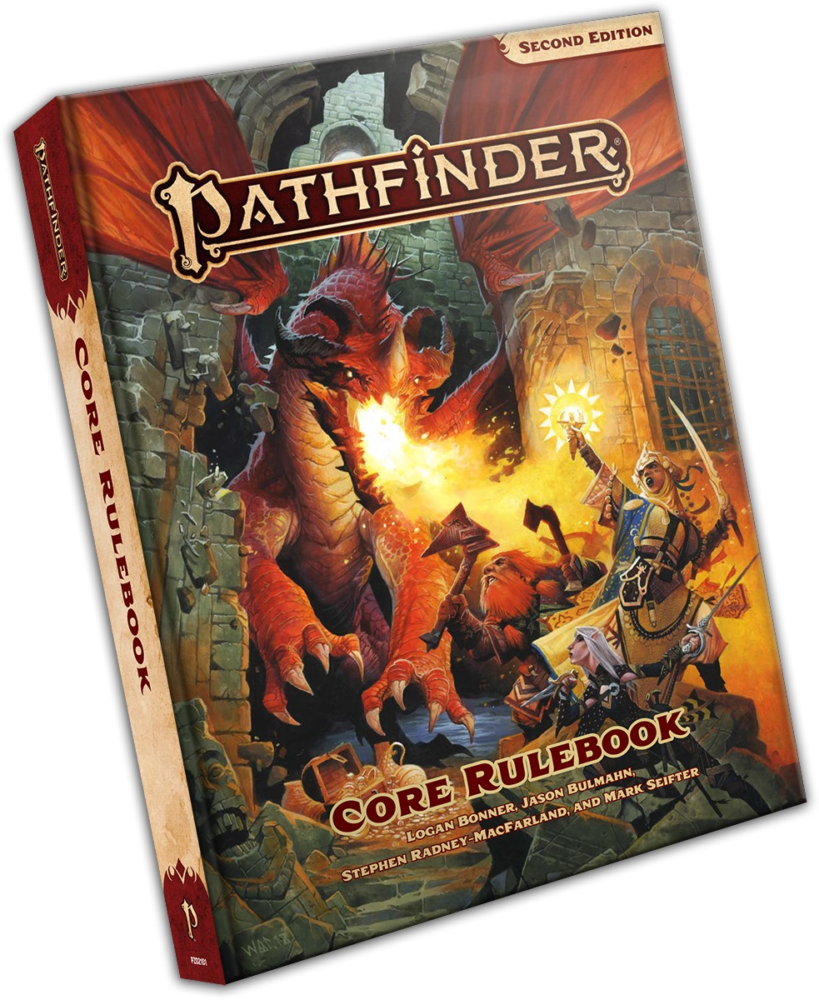

# Pathfinder Core Rulebook

**Link:** **[Paizo](https://paizo.com/products/btq01y0k?Pathfinder-Core-Rulebook)**
**ISBN:** *978-1-64078-168-9*
**Released:** *8/1/2019*
**Errata:** 4th

>[!quote] From the Paizo Webstore
>This comprehensive 640-page guide to the Pathfinder roleplaying game provides everything you need to set out into a world of limitless fantasy adventure! Choose from ancestries like elf, human, and goblin and classes like alchemist, fighter, and sorcerer to create a hero of your own design, destined to become a legend! The new Pathfinder rules are easier to learn and faster to play, and they offer deeper customization than ever before!
>
> This indispensable volume contains the core rules for players and Game Masters, and is your first step on a heroic new journey!

## Errata Updates

