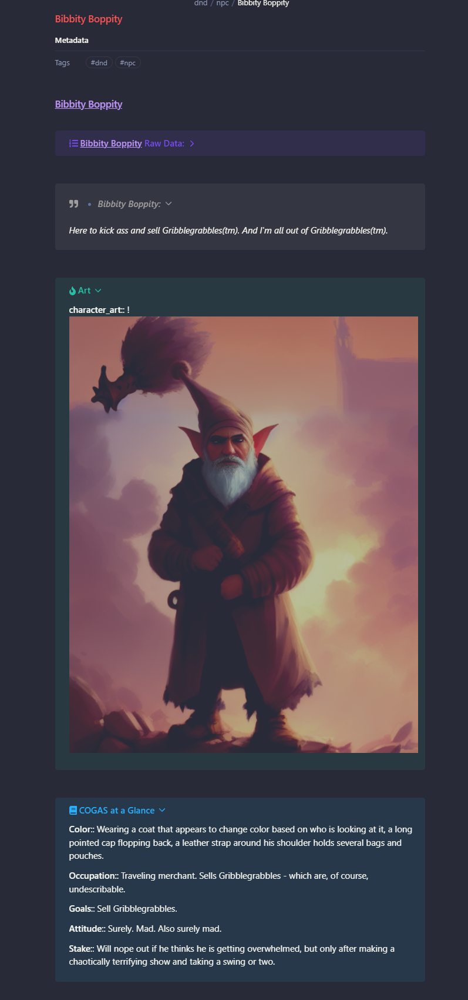

# ViXxuASXbar's NPC Template
**Plugin Dependencies**: 
[Dataview](https://github.com/blacksmithgu/obsidian-dataview)
[Templater](https://github.com/SilentVoid13/Templater)
[Admonitions](https://github.com/valentine195/obsidian-admonition)
**Thanks To**: [ViXxuASXbar](https://github.com/SONDLecT/obsidian-dm-templates)


## Goals
Provide aesthetically interesting, consistent structure and templates to assist preparing for a D&D session, campaign or adventure.

## How to Use
Remove the backtick codeblocks and these instructions from within Obsidian, to be able to use the template below.


## How It May Look




``````
---
type: "npc"
tags:
  - "dnd"
  - "npc"

date_added: <% tp.date.now("YYYY-MM-DD") %>
---
# [[<% tp.file.title %>]]

```ad-example
title: [[<% tp.file.title %>]]  Raw Data:
collapse: closed
**summary**:: 
**campaign**:: 
**aliases**:: 
**alignment**::
**organization**::
**location**::
**race**::
**gender**::
**class**::
```
```ad-quote
title: - *<%tp.file.title%>:*
collapse: open
*`= this.summary`*
```

```ad-hint
title: Art
collapse: open
**character_art**:: 
```

```ad-summary
title: COGAS at a Glance
collapse: open
**Color**:: 
**Occupation**::
**Goals**::
**Attitude**::
**Stake**::
```

```ad-caution
title: Statblock
# Statblock:
```


---
```ad-example
title: Mentions in Session Notes
```dataview
TABLE summary AS "Session Summary" FROM #session-notes AND [[<%tp.file.title%>]]
```


<% await tp.file.move("/dnd/npc/" + tp.file.title) %>
``````